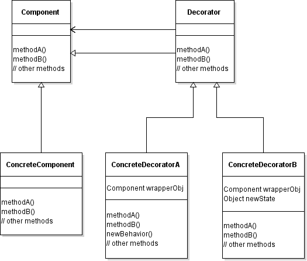

## Notes

### Design Principles
- Classes should be open for extension, but closed for modification

The **Decorator** pattern attaches additional responsibilities to an object dynamically. Decorators provide a flexible alternative to subclassing for extended functionality.

