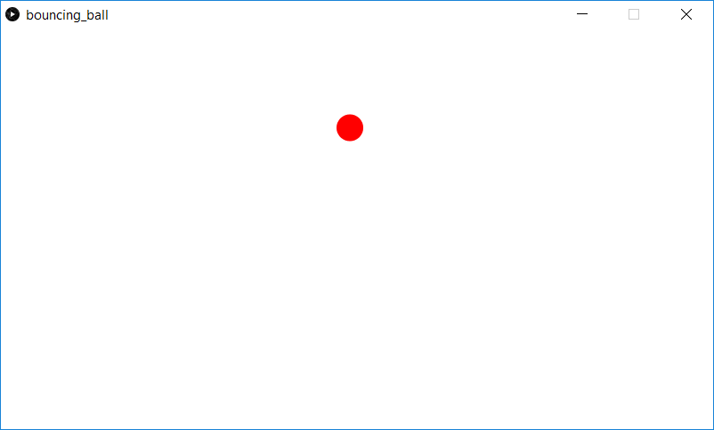

This a simple ball-bouncing physics simulation. The ball starts of in (0,0) and then follows a bouncing parabolic trajectory. The ball will change directions off the side walls and top of the screen. When the user clicks the mouse button, the ball will "hit" upwards somewhat.

Screenshot:  

