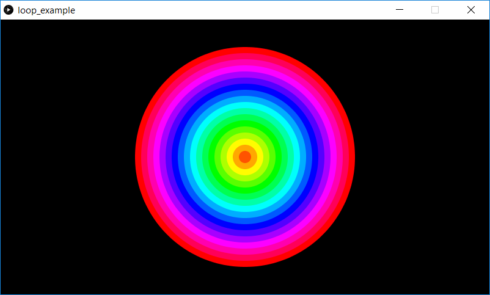

This a program which demonstrates the use of a for() loop. The HSB color space is used, and circles are drawn where each circle is filled with some color which cycles across the HSB hue space.

Screenshot:  

