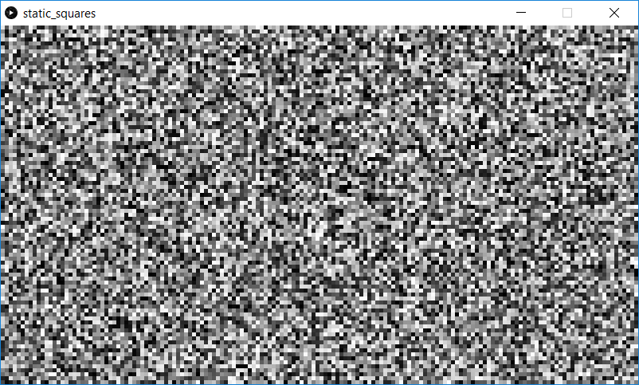

This is a program which demonstrates a nested for() loop. In this example, the screen is filled with random Black or White sqaures. It looks somewhat like "snow" from an old analog TV.

Screenshot:  

