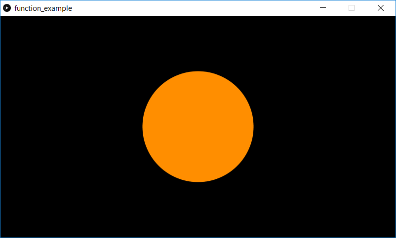

This is a simple program which demonstrates how a user-defined function can be used. In this example, a circle is drawn centered in the window. The hue is based on the distance from the center of the window to the mouse position.

Screenshot:  

