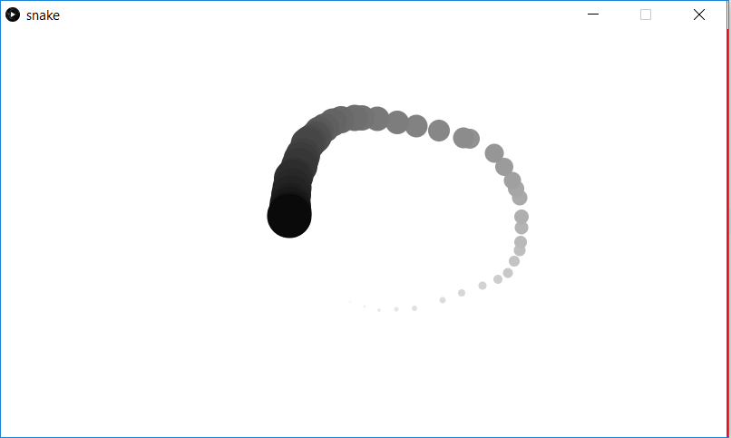

This example demonstrates the use of arrays in Processing. As the user moves the mouse around, a trail of ellipses are drawn where each is slightly lighter than the next, with the most recent being the darkest.

Screenshot:  
