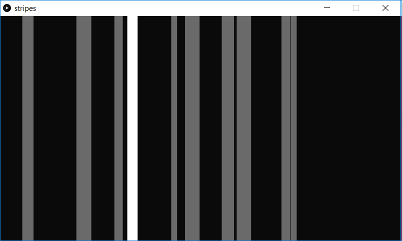

This is another array use example. When the program begins, a number of *Stripe* objects are instantiated. As the program runs, they move to the right. When the user hovers over a stripe with the mouse, it will be White, otherwise will some shade of Grey.

Screenshot:  

