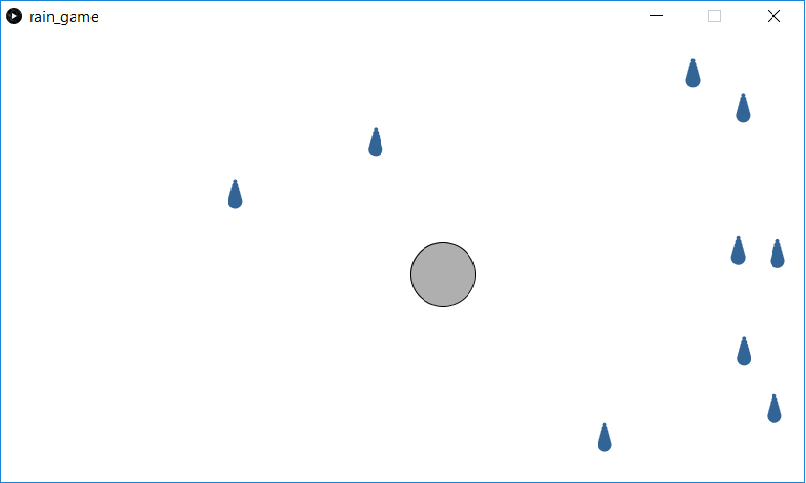

This is a simple demonstration which combines earlier lessons into a larger project using several classes. As the program runs, simulated "raindrops" are created offscreen in a random location. As the program runs, these raindrops fall. The user can move a "catcher". If the catcher and raindrop intersect, then that raindrop disappears.

Screenshot:  

