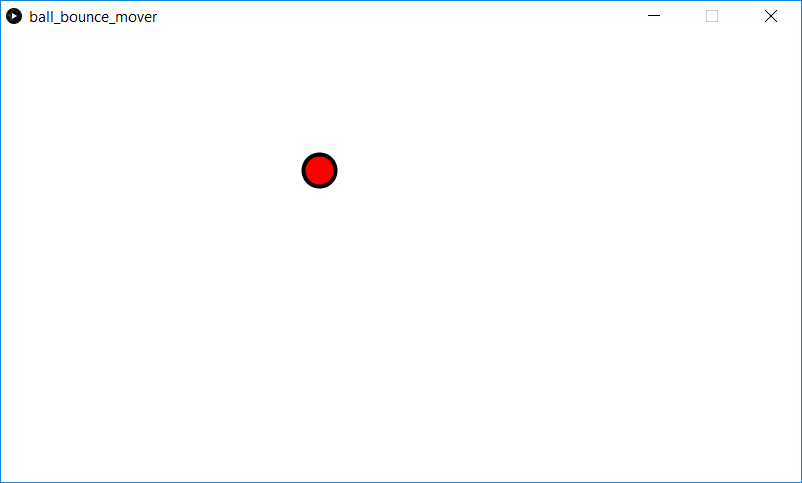

This is a simple ball bouncing demonstration which uses PVectors. The ball starts at a random position with a random velocity. When the ball hits the window boundary, it changes directions. This version adds a *Mover* class which implements the ball behavior.

Screenshot:  

