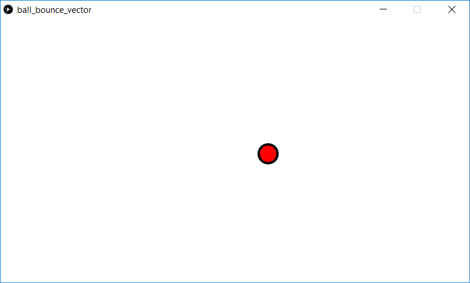

This is a simple ball bouncing demonstration which uses PVectors. The ball starts at a upper left with a set velocity. When the ball hits the window boundary, it changes directions.

Screenshot:  

