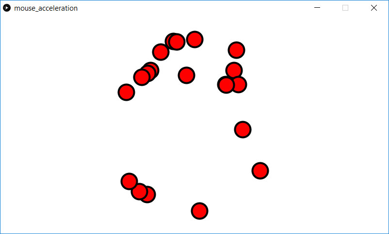

This program demonstrates some simple physics. Multiple *Mover* objects are generated at random positions, each with zero velocity. The *Mover* objects are accelerated towards the mouse position. The sides of the screen wrap instead of bounce. So if a ball goes off the left, it will show up on the right. The same is true of the top and bottom.

If the mouse is stationary, the *Mover*s will tend to orbit the mouse.

Screenshot:  
