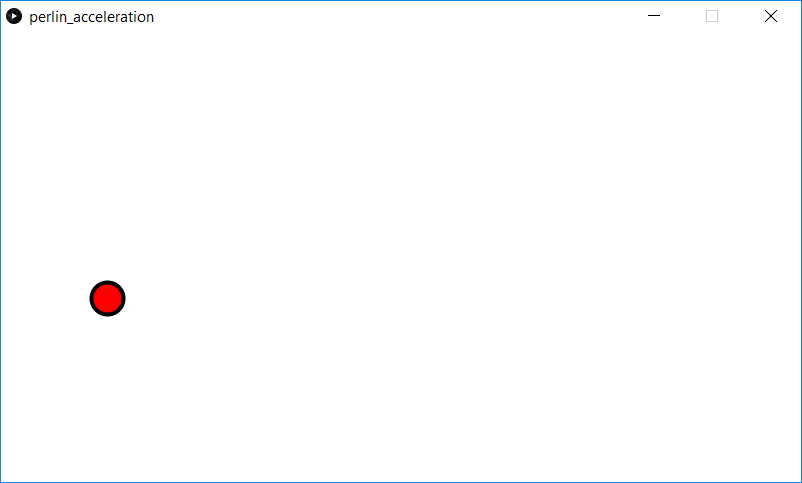

This is another ball bouncing demo. The ball bounces around the screen, reversing its direction when the sides are hit. The ball or *Mover* is subject to random *Perlin* acceleration.

Screenshot:  
