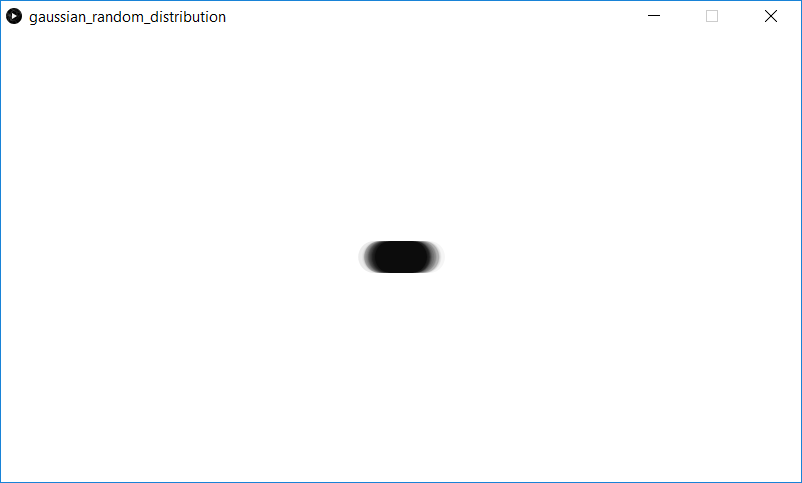
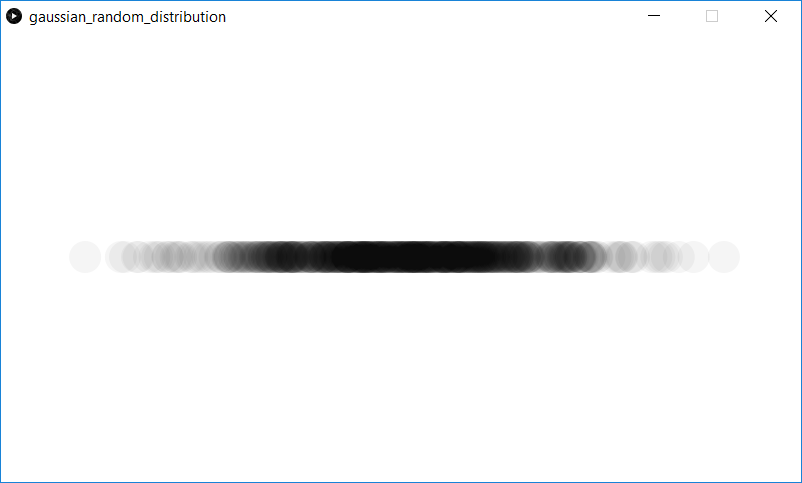

This is a demonstration of Gaussian random distribution. As the program runs, ellipses are drawn each time at some random x position in the window, where the x is some Gaussian random number.

Low standard deviation:  

High standard deviation:  
