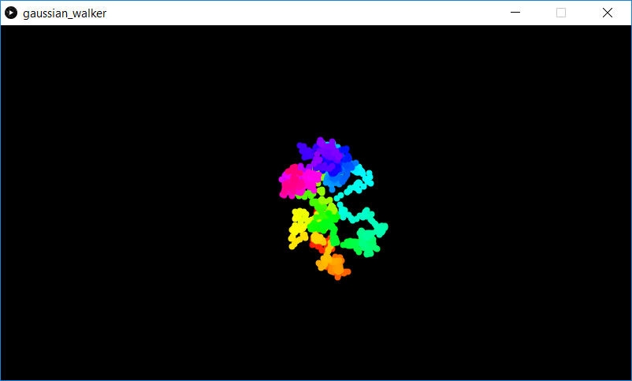

This is a demonstration of a random *walker* where the x,y position is updated using a Gaussion random distribution. As the walker moves, its hue shifts so it's easier to see how it moves over time.

Screenshot:  
