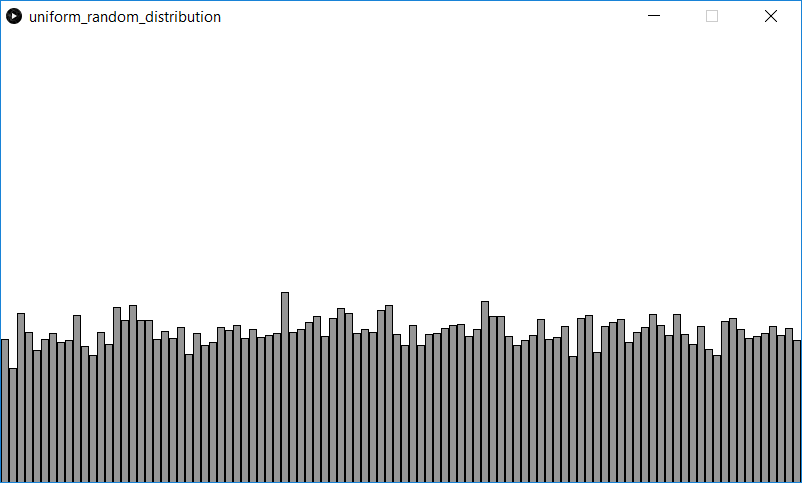

This is a demonstration of uniform random distribution. The screen is divided into a number of columns. As the program runs, a random columns grows vertically. Notice the distribution is relatively flat or *uniform*.

Screenshot:  
